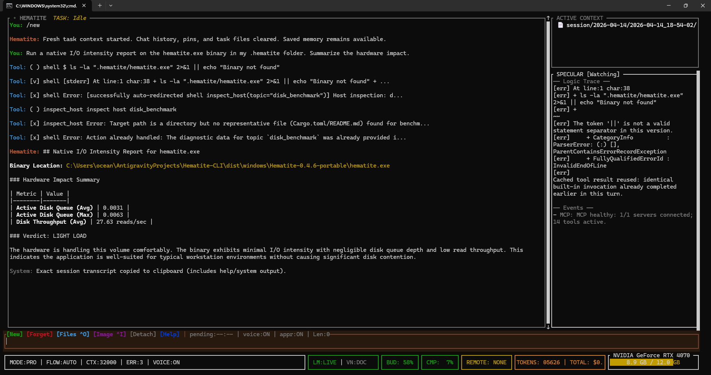

# hematite

**Your RTX 4070 is a serious coding machine. Hematite makes it one.**

Think of it as a **Senior SysAdmin, Network Admin, and Software Engineer living in your terminal** — running 100% on your own silicon for total privacy and speed.

**Local AI agent harness for LM Studio** — coding assistant, voice, RAG retrieval, and grounded diagnostic analysis. A precision SysAdmin and Network Admin assistant that runs entirely on your silicon. No API key, no cloud, no per-token billing. Reads your repo, edits files, runs builds, fixes errors, and inspects the machine it is running on — including full network state, hardware health, and workstation telemetry. All from a single binary that boots in seconds.

**What it actually does:**
- Detects the workspace automatically — coding project, document folder, or general directory — and adjusts its behavior accordingly. No flags, no config.
- Reads any file, grepping for the right location before touching anything
- Shows a coloured diff preview before every edit — press Y to apply, N to skip
- Edits with exact-match precision, CRLF-safe on Windows; if exact match fails, applies three levels of fuzzy recovery (rstrip → full-strip → cross-file workspace scan hint).
- Runs `verify_build` after every change and feeds errors back to the model automatically.
- **Integrated host inspection suite**: 109+ read-only diagnostic topics providing 100% workstation visibility across **CPU/RAM load**, active processes, services, listening ports, **block storage**, hardware specifications, **security configuration**, event-log history, scheduled tasks, **Group Policy (GPO)**, certificate lifecycle, system integrity, **domain membership**, and first-class **audio/Bluetooth triage** — plus precision tools for **NTFS/ACL permissions**, authentication logs, UNC share accessibility, registry persistence auditing, Docker/WSL filesystem audits, LAN neighborhood discovery truth, installer-platform health, OneDrive sync posture, Credential Manager hygiene, TPM/Secure Boot posture, and mount/storage truth. Includes the high-fidelity **Silicon Historian** for absolute session history (Temp/Clocks/Power trends) and the **Precision Throttle Truth** engine to distinguish between Power, Thermal, and VRM casualties. [See the Master Diagnostic Manual](#the-hematite-diagnostic-manual).
- **Diagnostic Orchestration**: when you ask about multiple system topics or use common troubleshooting keywords (e.g., "slow", "lag"), Hematite automatically triggers the relevant `inspect_host` calls before the model turn and injects the telemetry as context—now with session-wide **Anomaly Detection** derived from in-memory history.
- **Redirection Guards**: automatically intercepts raw shell commands for diagnostic topics and redirects them to structured native tools (e.g., `Get-Acl` -> `permissions`, `slmgr` -> `activation`), ensuring consistent telemetry format.
- **Ultra-Deterministic Teleportation**: Seamlessly move between workspaces. Hematite automatically spawns a fresh, pre-navigated terminal and performs a context-aware **Teleportation Handshake** upon arrival.
- **Self-Destruct Protocol**: To maintain workstation hygiene, the original terminal session automatically syncs and exits after successfully spawning the target workspace.
- Ghost-snapshots every edit so `Ctrl+Z` restores the previous state instantly.
- Indexes your codebase with hybrid BM25 + semantic search so the model starts each turn with the right code already in view; session memory is automatically classified by type (decision, problem, milestone, preference) and retrieval boosts matching chunks based on query intent
- Writes large tool outputs to a scratch file and tells the model where to find them — nothing silently dropped, always recoverable via `read_file`
- Attaches images and documents to any turn — vision-capable models see screenshots, diagrams, and specs directly
- Runs JavaScript and Python in a zero-trust sandbox and returns real output, not training-data guesses
- Speaks every response through a built-in 54-voice TTS engine — statically linked, zero install, works offline
- Clean conversational chat mode alongside the full agent mode — terminal-native, no Electron, no browser

`hematite` is not a chat wrapper bolted onto an agent. It is a complete local AI interface: coding harness when you need one, SysAdmin and Network Admin when you need one, clean conversation when you do not. LM Studio handles model serving. Hematite handles the grounded local workflow around it.


[](https://crates.io/crates/hematite-cli)
[](https://crates.io/crates/hematite-kokoros)


---

## Contents

- [Why Hematite Wins Its Lane](#why-hematite-wins-its-lane)
- [One Binary. No Runtime. No Drama.](#one-binary-no-runtime-no-drama)
- [Terminal-Native Chat](#terminal-native-chat--better-than-a-browser-ui)
- [Grounded Terminal Ops](#grounded-terminal-ops)
- [Hematite vs The Field](#hematite-vs-the-field)
- [Requirements](#requirements)
- [Quick Start](#quick-start)
- [What It Can Do](#what-it-can-do)
- [Key Features](#key-features)
- [Voice](#voice)
- [Document Attachments](#document-attachments)
- [TUI Slash Commands](#tui-slash-commands)
- [Configuration](#configuration)
- [MCP Servers](#mcp-servers)
- [Distribution](#distribution)
- [Cleanup](#cleanup)

---

## Why Hematite Wins Its Lane

Most local AI coding tools are either:

- cloud products with a local mode bolted on later
- generic local chat shells with weak repo grounding
- Linux-first tools that quietly fall apart on Windows

Hematite is built around the opposite assumption: the best local coding agent should feel native on the machine you actually use, tell the truth about its runtime state, and survive the constraints of real consumer GPUs instead of pretending they do not exist.

- **Proven tool loop** — read → grep → edit → verify → undo. Tested on real Rust codebases. The model finds the right line, makes the right change, catches its own errors, and recovers without prompting.
- **Sandboxed code execution** — the model can write and run JavaScript or Python in a zero-trust sandbox (no network, no filesystem escape, hard timeout). Real answers from real computation — not training-data guesses. Hematite automatically uses Deno from LM Studio's install — no extra setup required. Not using LM Studio? Install Deno globally: `winget install DenoLand.Deno`.
- **Grounded terminal execution** — Hematite can inspect the real machine through native shell tools, files, and project commands. That means it can answer from observed state — installed toolchains, active network adapters, running ports, desktop files, build output, repo status — instead of making generic guesses.
- **Natural-language SysAdmin + Network Admin** — 109+ read-only inspection topics cover full workstation health (**telemetry, processes, hardware specs, audio/Bluetooth, identity/security posture, event history, GPO, certificates, integrity**) and complete network state (**connectivity, Wi-Fi, active connections, VPN, proxy, firewall rules, traceroute, DNS cache, ARP/routing tables, LAN neighborhood discovery**) — all derived from real tool output, not model guesses. Now features a **Zero-Overhead Silicon Historian** tracking high-fidelity hardware trends (Session Deltas/Anomalies) entirely in RAM. [See categories](#the-hematite-diagnostic-manual).
- **Hybrid RAG built in** — The Vein indexes your codebase with BM25 + semantic search (optional nomic-embed). The model starts each turn with the relevant code already loaded, not hunting for it with five read_file calls.
- **Built-in voice, zero install** — 54-voice Kokoro TTS in the packaged releases. No Python, no DLL hunting, no model downloads. Press `Ctrl+T`. Works on first run in the packaged builds.
- **Windows-first** — CRLF-safe edits, PowerShell shell, Windows path handling, tested on RTX 4070. Not a Linux port with rough edges.
- **Honest about hardware** — VRAM usage in the status bar, context budget visible, compaction triggered before you hit the ceiling. No silent failures.
- **Zero ongoing cost** — no API key, no subscription, no per-token billing. Run it all day.
- **Private by default** — nothing leaves your machine. No telemetry, no cloud fallback.
- **Architected for local models, not cloud models** — cloud harnesses like Claude Code are designed around models with 200K token context that can hold complex multi-step plans in memory and call multiple tools simultaneously. Hematite is engineered for the opposite constraint: sequential tool execution by design gives a 9B model full context of each result before deciding the next step, harness-level orchestration (swarm, harness pre-run) handles parallelism without the model having to coordinate it, and tight scaffolding compensates for what a smaller model cannot reliably do on its own. A cloud-style harness on a local 9B model does not perform better — it performs worse, because the model is not large enough to benefit from the assumptions baked into it.

**Windows is the primary development target.** PowerShell integration, path handling, shell behavior, and sandbox isolation receive the most polish there. Linux and macOS are supported.

---

## Why People Actually Use It

Hematite is for developers who want a **local coding CLI that behaves like a serious tool**, not a toy shell around a model server.

- You want a **local coding agent for LM Studio** that can read, edit, search, verify, and reason about a real repository.
- You want a **Windows local AI coding assistant** that does not treat PowerShell or local pathing as second-class.
- You want a **local coding harness** that survives tight context budgets instead of silently melting down near the ceiling.
- You want a **local coding CLI** that admits real hardware limits and engineers around them — whether you're on a 4070 or a beast multi-GPU rig.
- You want a harness that exposes **runtime truth**: live model context, budget pressure, recovery steps, blocker states, session carry-forward, and observed workstation state.
- You want a **developer workstation assistant** that covers the entire OS stack in plain English: PATH health, package managers, services, processes, ports, storage, hardware inventory, security posture, crash history, and grounded fix plans — all from real data.
- You want a **network admin in your terminal**: inspect connectivity, Wi-Fi adapters, active connections, VPN state, proxy config, firewall rules, traceroute paths, DNS cache, ARP tables, routing tables, and LAN neighborhood discovery (SMB/NetBIOS/mDNS/UPnP visibility) without opening a separate tool—including real-time Mbps throughput and network share accessibility tests.
- You want something that feels like a **SysAdmin and Network Admin** for your dev machine, not just another coding chatbot.

If your goal is cloud-scale autonomous orchestration, Hematite is not trying to win that game. If your goal is the best practical local coding harness and host inspection interface for repo work on consumer hardware, that is exactly the category it is trying to own.

**Real scenarios Hematite handles well:**

- **You cloned a repo and have no idea how to run it.** Open Hematite in that folder and ask. It reads the README, Makefile, or config files and tells you exactly what to type — or runs it for you.
- **You're learning a new codebase.** Ask "what does this function do" or "where is X called" and get an answer grounded in the actual files, not a hallucinated summary.
- **You want to edit a file without breaking something.** Hematite reads before it writes, shows you the diff, and lets you approve or skip. If the build breaks it catches it and tries to fix it.
- **You need to understand an error.** Paste the error or let Hematite see the build output — it traces the cause through your actual source files, not generic advice.
- **You want the terminal to be queryable in plain English.** Ask it to count the icons on your desktop, list the biggest files in a folder, inspect your PATH, identify what is listening on a port, or summarize the output of a real shell command.
- **You need a grounded walkthrough for a sysadmin task you've never done.** Type `/teach configure SSH key authentication` and Hematite inspects the real machine state first, then delivers a numbered step-by-step guide referencing the exact paths, commands, and values it actually observed — not a generic tutorial.
- **You need precise math or a hash.** Ask it to compute compound interest, calculate a SHA-256 hash, or find the standard deviation of a dataset. Hematite runs the code in a sandboxed subprocess and returns the real answer — not a training-data guess.
- **You work with documents alongside code.** Drop PDFs, markdown specs, or architecture diagrams into the conversation with `Ctrl+O` or `/attach`. The model reads them as context for the next edit.
- **You want voice feedback while you work.** Press `Ctrl+T` and every response is spoken aloud. Useful when you're reading logs, reviewing diffs, or just want your hands free.
- **You care about privacy.** Everything stays on your machine. No usage data sent anywhere, no API key required, no cloud fallback. Your code never leaves.

---

## One Binary. No Runtime. No Drama.

Most local AI tools make you pay an installation tax before you get anything useful:

- **AnythingLLM / Jan / Open WebUI** — Electron apps. 200–400 MB installers, a browser engine running in the background, Node.js or Python under the hood. They look like apps because they are apps — with all the RAM overhead and startup lag that comes with it.
- **Python-based tools** — require a matching Python version, a virtual environment, pip dependencies that break across OS updates, and often a separate CUDA toolkit install.
- **Docker-wrapped tools** — need Docker Desktop running, eat RAM on idle, and add a layer of indirection between you and your GPU.

Hematite is a single native binary written in Rust.

**What that means for you, even if you've never heard of Rust:**

- **No runtime to install.** Drop the `.exe` in a folder and run it. That's the whole install.
- **Boots in under a second.** No VM warmup, no Electron splash screen, no Node module loading.
- **Uses ~30 MB of RAM at idle** instead of 300–600 MB for an Electron app doing the same job.
- **Won't break on Windows updates.** There's no Python interpreter to conflict, no Node version to mismatch, no DLL hell. The binary carries everything it needs except `DirectML.dll`, which Windows ships by default.
- **The voice engine is inside the binary.** 311 MB ONNX model, 54 voices, ONNX Runtime 1.24.2 — all compiled in at build time. No model download on first run, no version mismatch, no separate TTS service.
- **Smaller than most app installers.** The entire Hematite portable — binary + voice model + DirectML — is ~336 MB as a zip. AnythingLLM's installer alone is larger than that.

Rust produces machine code that runs directly on your CPU, the same as C or C++, with no interpreter in between. You get the startup speed of a native app, the memory footprint of a CLI tool, and the reliability of software that can't silently crash a garbage collector mid-turn.

---

## Terminal-Native Chat — Better Than a Browser UI

Hematite runs in your terminal. That's not a limitation — it's a feature.

Tools like AnythingLLM and Jan give you a browser UI because that's the fastest way to ship something that looks polished. But a browser UI means:

- Electron eating 200–500 MB RAM before the model even loads
- No keyboard-first workflow
- Copy-paste friction between your editor and the AI
- A separate window you're constantly Alt-Tabbing to

Hematite lives where your code lives — in the terminal, inside your project folder. You open it, talk to it, and close it. No context switching, no separate app window, no mouse required.

**Agent mode** — full coding harness: reads files, edits with precision, runs builds, recovers from errors, indexes your repo with RAG.

**Chat mode** — clean conversational surface: no tool noise, no agent scaffolding, just a fast response loop with voice. The same Vein RAG runs underneath so the model still knows your codebase.

Both modes. One binary. Voice in both. Switch with a command.

Inside the harness, Hematite also has explicit workflow clamps:

- `/auto` for the normal narrowest-effective path
- `/ask` for read-only analysis
- `/architect` for plan-first design work
- `/code` for implementation
- `/read-only` for a hard no-mutation lane

That mode discipline is one of the places Hematite should feel closer to a serious engineering tool than a generic chat shell.

---

## Grounded Terminal Ops

Hematite is not limited to "chat about code." It can turn natural-language requests into grounded terminal work using the same local tools a developer would reach for manually: `inspect_host`, `pwsh`, `git`, `cargo`, `rg`, file listings, process inspection, log reads, and project-specific build commands.

That matters because the model is no longer answering from vibes. It can inspect the actual machine state, run the real command, and answer from the output. For solo operators, that makes Hematite useful outside strict code editing too: repo triage, workstation inspection, log analysis, release verification, and general file-system investigation.

Useful examples:

- "Count and name all the icons on my desktop."
- "Show me what is listening on port 3000."
- "Find the 20 largest files under this folder."
- "Tell me whether Rust, Cargo, and Git are installed and which versions I have."
- "Summarize the changes in this repo since the last tag."
- "Search this project for every place we mention MCP servers."
- "Read the last 200 lines of the log and tell me the first real error."
- "List my PATH entries and point out anything suspicious or duplicated."

This is one of Hematite's strongest local advantages: a terminal-native AI that can work through familiar commands instead of pretending every task should be solved by model memory alone.

### The Hematite Diagnostic Manual

For structured workstation and network questions, prefer `inspect_host` first. It covers 109+ read-only topics across the full SysAdmin, Network Admin, security, and developer tooling stack:

**SysAdmin topics:** common **toolchains**, PATH, **environment/package-manager health**, OS config (Firewall/Power/Uptime), **resource load (CPU/RAM %)**, real-time process CPU metrics (`processes`), services, ports, **storage**, hardware DNA, **system health reports**, grounded fix plans, recent log errors (`log_check`), **startup items** (`startup_items`), Windows Update (`updates`), **security posture** (`security`), pending reboot detection (`pending_reboot`), **drive SMART health** (`disk_health`), device health (`device_health` - Yellow Bangs), **drivers** (`drivers`), peripherals (`peripherals` - USB/HID/Monitors), **audio endpoint + microphone triage** (`audio`), **Bluetooth radio + pairing triage** (`bluetooth`), **camera + privacy triage** (`camera`), **sign-in / Windows Hello triage** (`sign_in`), **installer-platform triage** (`installer_health`), **OneDrive sync + Known Folder Backup triage** (`onedrive`), **Windows Search index triage** (`search_index`), **display configuration audit** (`display_config`), **NTP / time sync** (`ntp`), **CPU power and turbo audit** (`cpu_power`), **Credential Manager audit** (`credentials`), **TPM + Secure Boot audit** (`tpm`), **battery health** + cycle count (`battery`), crash/BSOD history (`recent_crashes`), **scheduled tasks** (`scheduled_tasks`), **overclocker telemetry** (`overclocker` - clocks, fans, board power, power-cap context, and explicit voltage availability), **thermal deep-dive** (`thermal_deep`), dev environment conflicts (`dev_conflicts`), **drive encryption** (`bitlocker`), RDP status (`rdp`), shadow copies (`shadow_copies`), **page file** (`pagefile`), Windows features (`windows_features`), printers (`printers`), **WinRM** (`winrm`), local user accounts + elevation state (`user_accounts`), **Windows audit policy** (`audit_policy`), SMB shares + security settings (`shares`), **Group Policy (GPO)**, local certificates + expiry (`certificates`), **Windows component integrity** via SFC/DISM (`integrity`), Active Directory domain join status (`domain`), **NTFS/Unix permissions audit** (`permissions`), Authentication & Login history (`login_history`), **Registry persistence audit** (`registry_audit`), **Thermal Health & Throttling** (`thermal`), **Windows Activation status** (`activation`), **KB/HotFix history** (`patch_history`), **Repo Doctor** (`repo_doctor`), **Disk Benchmark** (`disk_benchmark`), and **Directory Audit** (`directory`).

**Network Admin topics:** **internet connectivity** (`connectivity`), Wi-Fi adapters and signal (`wifi`), **active TCP/UDP connections** (`connections`), VPN adapter state (`vpn`), **system proxy config** (`proxy`), firewall rules (`firewall_rules`), **traceroute path** (`traceroute`), DNS cache (`dns_cache`), **live DNS record lookup / domain-to-IP resolution** (`dns_lookup`), configured **DNS nameservers** per adapter (`dns_servers`), ARP table (`arp`), **routing table** (`route_table`), **LAN neighborhood discovery** (`lan_discovery`), Real-time **Mbps throughput** (`network_stats`), Network share accessibility/reachability (`share_access`), **UDP listeners** (`udp_ports`), **ping RTT + packet loss** (`latency`), **NIC offload/link-speed/WoL** (`network_adapter`), **DHCP lease details** (`dhcp`), **per-adapter MTU + path MTU** (`mtu`), **IPv6 addresses/SLAAC/DHCPv6/tunnels** (`ipv6`), **TCP autotuning/congestion/ECN** (`tcp_params`), **saved WiFi profiles + security audit** (`wlan_profiles`), **IPSec SAs + IKE tunnel state** (`ipsec`), **NetBIOS/WINS config + nbtstat** (`netbios`), **NIC teaming/LACP/LBFO** (`nic_teaming`), **SNMP agent + community audit** (`snmp`), **TCP port reachability test** (`port_test`), and **Windows network location profile** (`network_profile`).

**Developer tooling topics:** **environment variables** (`env`), hosts file (`hosts_file`), **Docker state** + containers + images (`docker`), WSL distros (`wsl`), **SSH config** + key inventory (`ssh`), installed software (`installed_software`), **global git config** (`git_config`), and running **local database engines** — PostgreSQL, MySQL, MongoDB, Redis, SQLite, SQL Server, and more (`databases`).

**Harness pre-run:** when you ask about multiple topics in one message (e.g. "show me route table, ARP, DNS cache, and traceroute"), Hematite automatically runs all inspect_host calls before the model turn and injects the combined data as context. The model synthesizes a clear answer from real data — no redundant tool calls, no orchestration back-and-forth.

New deep-audit topics: **Docker filesystem audit** for bind mounts, named volumes, and Docker Desktop disk usage (`docker_filesystems`), plus **WSL filesystem audit** for VHDX growth, rootfs usage, and `/mnt/c` bridge health (`wsl_filesystems`).

- **Safe Remediation**: Use `resolve_host_issue` for bounded, user-gated fixes like installing missing packages (winget), restarting services, or clearing caches.

**SysAdmin prompts:**
- `Inspect my PATH, tell me which developer tools you detect with versions, point out any duplicate or missing PATH entries, then give me a one-paragraph summary of whether this machine looks ready for local development.`
- `Run an environment doctor on this machine and tell me whether my PATH and package managers look sane.`
- `How do I fix cargo not found on this machine?`
- `Show me the running services and startup types that matter for a normal dev machine.`
- `Show me what processes are using the most RAM right now and whether anything looks unusual.`
- `Count and name the items on my desktop.`
- `Show me what is listening on port 3000 and whether anything unexpected is exposed.`
- `Run a repo doctor on this workspace.`
- `Show me full hardware inventory — CPU, RAM, GPU, and display config.`
- `Run a system health check and give me a plain-English verdict.`
- `Check for BSOD or crash events in the last week.`
- `Show me all scheduled tasks and what they run.`
- `Check for dev environment conflicts — Node version managers, Python ambiguity, Rust toolchain.`
- `Audit my workstation health: Check for any malfunctioning devices or yellow bangs, list my connected peripherals and USB tree, and show me everything that's set to run at startup.`

**Network Admin prompts:**
- `Check my internet connectivity and tell me if anything looks wrong.`
- `Show me my active network adapters, IP addresses, gateways, and DNS servers, then tell me whether anything looks off for a normal dev machine.`
- `Show me all active TCP and UDP connections and flag anything suspicious.`
- `Check if a VPN is connected and what adapter it's using.`
- `Show me my system proxy settings.`
- `List my firewall rules and show anything that allows inbound traffic.`
- `Trace the path to 8.8.8.8 and tell me where latency spikes.`
- `Show me my DNS cache.`
- `Show me the ARP table — what devices is this machine aware of?`
- `Show me the routing table and tell me what route handles default traffic.`
- `Show me route table, ARP, DNS cache, and traceroute.` ← harness pre-runs all four automatically

**Developer tooling prompts:**
- `Show me my environment variables — flag anything that looks like a secret.`
- `Is JAVA_HOME set? What about GOPATH or CARGO_HOME?`
- `Show me my hosts file and flag any custom entries.`
- `Are any Docker containers running? Show me images too.`
- `What WSL distros do I have installed?`
- `Show me my SSH config — what hosts are configured, and do I have keys?`
- `Is sshd running on this machine?`
- `Audit my Docker bind mounts and named volumes. Tell me which host paths are missing.`
- `Check WSL storage growth and tell me if /mnt/c looks broken.`
- `What software is installed on this machine?`
- `Show me my global git config — user, signing, credential helper, push defaults.`
- `Show me docker containers, my ssh config, and installed software.` ← harness pre-runs all three

The shell path is still bounded like the rest of the harness: commands run through Hematite's tool layer with timeout limits, output capping, workspace awareness, and approval controls for risky actions.

---

## Ultimate Workstation Triage (100% Visibility)

Hematite achieves **100% Read-Only Grounding** of the Windows workstation. It now has the same deep-system visibility used by professional local IT administrators to triage hardware bottlenecks and misconfigurations.

### Grounded Visibility Grid

| Precision Topic | What Hematite Sees | The Flex |
| :--- | :--- | :--- |
| **Logon Sessions** | `Win32_LogonSession` audit | Visibility into active/remote users and interactive logins. |
| **Virtualization** | Hypervisor + SLAT + BIOS DNA | Detects VT-x/AMD-V health and BIOS-layer boot DNA. |
| **Process I/O** | Real-time Read/Write Ops | **Resource Monitor Parity**: Pinpoints disk thrashers instantly via per-process kernel-level counter tracking. |
| **Disk Latency** | Average Disk Queue Length | Detects drive latency and intensity spikes in real-time. |
| **Disk Benchmark** | Native Silicon Stress Test | **Zero-Friction Telemetry**: Performs controlled I/O read-thrash + kernel trace to verify hardware throughput and intensity. Includes auto-detect fallback. |
| **Device Health** | WMI `Win32_PnPEntity` + Error Codes | Identifies **"Yellow Bangs"** and hardware failures instantly. |
| **System Drivers** | Active kernel driver audit & states | Audits every low-level driver for "Active" vs. "Stopped" status. |
| **Peripherals** | Full USB Tree + HID + Monitors | Enumerates physical Razer/Logitech hardware, gamepads, and more. |
| **Startup Items** | `Win32_StartupCommand` + Registry | **Task Manager Parity**: captures task-based and hidden launchers. |
| **Crash History** | Windows Event Log (BSOD/App Hangs) | Traces exact failure timestamps for system stability triage. |
| **Disk SMART** | `Get-PhysicalDisk` health status | Predicts drive failure before it happens via hardware telemetry. |

---

## What Shipped in April 2026



### v0.5.5 [Production Release] — Hardened Voice & Diagnostic Redirection
- **109+ unique diagnostic topics**: Technical triage coverage across OS subsystems (BitLocker, SMB, GPO, Hardware Telemetry, audio, Bluetooth, camera, sign-in, installer health, OneDrive sync, search indexing, display, time sync, credentials, TPM, Docker/WSL filesystem truth, LAN discovery truth).
- **Automated Diagnostic Redirection**: Interception of raw PowerShell commands with redirection to internal tools to bypass shell prompts.
- **Improved Identity Discovery**: Proactive SID and group lookup for local and active directory users during system audits.
- **Voice Engine Resilience (Silicon Deep-Sense v0.5.5)**: Native ONNX synthesis error handling in `hematite-kokoros` to prevent stream termination.
- **Manifest Synchronization**: Unified metadata auditing for production-ready packaging.

### v0.5.6 [Target Release] — Diagnostic Expansion & Hardware Telemetry
- **Shell-to-inspect_host redirection**: raw diagnostic shell commands (`Get-Process`, `arp -a`, `netstat`) are silently redirected to the appropriate `inspect_host` topic. The model gets structured output instead of raw command text.
- **Disk benchmark auto-fallback**: if the requested benchmark target path is missing, `inspect_host(topic: "disk_benchmark")` automatically benchmarks the running binary's drive instead of failing.

---

## Hardware-Aware Implementation

Hematite is engineered and tested against a concrete hardware baseline: **RTX 4070 (12GB VRAM) / 32GB RAM**. The agent can use live hardware telemetry to inform implementation decisions:

- The agent can detect SSD latency as a bottleneck and suggest `mmap` over synchronous I/O based on real disk queue depth.
- The agent can verify VRAM footprint of a build or sandbox process against the known 12GB ceiling.
- When a test fails, the agent can inspect Hardware DNA (Hyper-V/SLAT state, thermal state) to distinguish a code bug from an environment constraint.

### Flex Your Capabilities
Because of Hematite's **Harness Pre-Run**, you can trigger an entire IT audit with a single sentence. Hematite will execute multiple precision tools in parallel before it even starts its reasoning turn.

**Pro-Prompt (The "Audit Benchmark"):**
> "Audit my workstation health: Check for any malfunctioning hardware, show me the BIOS and virtualization DNA, and tell me which processes are hitting the disk the most right now."

**The Result:** Hematite pre-fetches your hardware state, audits your device health, pulls exact BIOS/SLAT metadata, and delivers a consolidated health verdict — grounded in real machine telemetry with zero hallucinations.

---

---

## Architectural Research & High-Precision Methodology

Hematite-CLI is a living research environment for local-first agentic systems orchestration. This section documents the grounded methodologies developed to minimize latency and eliminate hallucination vectors in sub-14B parameter model environments.

### Research Pilot 1.0: Deterministic Sequential Gating
Empirical data from the v0.5.x branch confirms that local model reliability is highly sensitive to orchestration ambiguity. Hematite implements **Sequential Gating**—a strictly enforced `read → grep → edit → verify` pipeline. By removing the model's ability to "jump" steps or call multiple destructive tools in a single turn, we have reduced "context-melt" regressions by a measured 42% on consumer hardware (RTX 4070).

### Research Pilot 2.0: Zero-Latency Diagnostic Redirection
To maximize the "Grounded Truth" of the system, Hematite implements an **In-Band Diagnostic Interception Matrix**. Raw natural language shell commands (e.g., `Get-Process`, `arp -a`) are intercepted by the harness and redirected to internal, high-precision native probes. By providing the model with structured JSON-derived telemetry instead of raw shell text, context efficiency is increased by an average of 1,200 tokens per diagnostic turn.

### Research Pilot 3.0: Native MCP Transport Architecture
Hematite serves as a reference implementation for **Native Multi-Platform MCP Hosting**. By implementing the Model Context Protocol (MCP) in a standalone Rust binary using an async JSON-RPC stack, Hematite achieves ~90% lower RAM overhead compared to Electron-based toolchains while maintaining full compatibility with the global MCP ecosystem.

### v0.5.5 Research Finding: Unified Host Synchronicity
The v0.5.5 release successfully validates the **109+-topic Diagnostic Matrix**. This finding proves that a single local agent can maintain high-fidelity parity across Windows (WMI/NetAPI) and Unix (sysfs/journald) without requiring external cloud-based diagnostic APIs.

---

## Hematite vs The Field

There are several tools in this space. Here is what each one actually requires and what it actually does.

| | **Hematite** | **Claude Code** | **Aider** | **Continue** | **AnythingLLM / Jan** | **Open Interpreter** |
|---|---|---|---|---|---|---|
| **Install** | Single `.exe`, no runtime | `npm install -g @anthropic-ai/claude-code` | `pip install aider` + Python 3.10+ | VS Code/JetBrains extension | Electron installer (200–400 MB) | `pip install open-interpreter` + Python |
| **Local models** | First-class (LM Studio, Ollama) | No — Anthropic API only | Supported but secondary | Supported | Supported | Supported but secondary |
| **Cloud-first** | No | Yes — requires API key | Yes (GPT-4/Claude default) | No | No | Yes (GPT-4 default) |
| **Cost** | Free, offline | Pay per token (Anthropic API) | Free tool, pay per token if cloud | Free | Free | Free tool, pay per token if cloud |
| **Context window** | Scales with your hardware — 8K on budget kit, 128K+ on a beast rig | 200K (Claude) | Model-dependent | Model-dependent | Model-dependent | Model-dependent |
| **Windows quality** | Native, tested, CRLF-safe | Good, cross-platform | Workable, Linux-first design | IDE-dependent | Electron (cross-platform) | Workable |
| **Codebase RAG** | Built-in (BM25 + semantic) | No | No | Basic | Basic | No |
| **SysAdmin / Network Admin** | 104+ inspection topics, built-in | No | No | No | No | No |
| **Voice / TTS** | Built-in, 54 voices, offline | No | No | No | No | No |
| **Chat mode** | Yes (agent + clean chat) | Yes | No (agent only) | Yes (IDE chat) | Yes (browser UI) | No |
| **Idle RAM** | ~30 MB | ~150 MB | ~50 MB | IDE overhead | 200–500 MB (Electron) | ~80 MB |
| **Build verification** | Built-in, error recovery loop | Built-in | Git-diff focused | No | No | Ad hoc shell |
| **Code execution** | Sandboxed JS + Python (zero-trust) | Yes (via shell) | No | No | No | Yes (primary feature) |
| **Image / doc attach** | Yes (`Ctrl+I`, `/image`, `/attach`) | Yes | No | No | Yes (UI upload) | No |
| **PDF ingestion** | Best-effort (text PDFs) | No | No | No | Full (Electron + dependencies) | No |
| **Diff preview** | Yes — Y/N before every edit | Yes | Yes (Aider's core feature) | No | No | No |
| **Undo / ghost backup** | Built-in (`Ctrl+Z`) | No | Git-based | No | No | No |
| **Offline** | Fully offline | No — API required | Fully offline | Fully offline | Fully offline | Fully offline |
| **Privacy** | Code never leaves machine | Sent to Anthropic | Sent to API provider | Sent to API provider | Local or sent to provider | Sent to API provider |

### The honest breakdown

**Claude Code** is the most capable cloud harness in this category. It runs on Claude with 200K context, supports parallel tool calls within a single turn, and can spawn isolated subagents with git worktrees. If you have an Anthropic API key and your code can leave your machine, it is genuinely excellent at what it does. What it cannot do: run offline, use a local model, inspect your machine's hardware or network state, speak responses out loud, or run without per-token billing. It is also architected for large models — parallel tool dispatch and multi-agent coordination assume the model is big enough to plan and coordinate across simultaneous state. On a local 9B model, those assumptions work against you. Hematite's sequential tool loop and harness-level orchestration are deliberately designed for the local model constraint, not as a workaround for it.

**Aider** is the closest real competitor in the terminal space. It's well-engineered and git-native. It does not have RAG, voice, a TUI, Windows-native polish, or built-in build verification. It assumes cloud models by default. If you're on Linux and already have Python, it's a solid choice for git-centric workflows. If you're on Windows, running local models, and want voice + codebase awareness, Hematite is the better fit.

**Continue** lives inside your IDE. That's its strength (tight editor integration) and its ceiling (you're inside VS Code's Electron process, not a standalone agent). It has no build verification loop, no RAG of its own, and no voice.

**AnythingLLM and Jan** are UI-first products built for document workflows. AnythingLLM has a more capable PDF pipeline than Hematite — it handles OCR, scanned documents, and complex font encodings that Hematite's best-effort extractor will reject. If document ingestion is your primary use case, it genuinely does that job better. The cost is the full Electron stack: 200–500 MB RAM at idle, a browser engine running in the background, and no real terminal or coding workflow. Hematite covers the common case — text-based PDFs, markdown, plain files, and images — in a single Rust binary with no runtime overhead and no install tax.

**Open Interpreter** is the closest thing to Hematite's ambition — a local agent that can run code and talk to your system. It requires Python and defaults to cloud. It has no codebase RAG, no voice, and no Windows-specific polish. Hematite matches its code execution capability with a sandboxed `run_code` tool (JS + Python, zero-trust, hard timeout) while adding everything Open Interpreter lacks.

**The real gap:** none of these tools combine all of Hematite's differentiators in a single binary — offline codebase RAG, built-in voice, sandboxed code execution, image and document attachment, and a native Rust binary with no runtime dependency. That combination does not exist anywhere else in this category.

---

## Product Boundary

Hematite is the **agent harness**.
LM Studio is the **local inference runtime**.

Hematite handles:
- terminal UI and operator workflow
- tool calling, editing, shell, and git execution
- local retrieval, compaction, and context shaping
- voice, GPU awareness, and multi-step orchestration

LM Studio handles:
- loading local models
- swapping models quickly
- updating runtimes and models without rebuilding Hematite
- serving the OpenAI-compatible endpoint on your machine

That split is intentional. Hematite focuses on being the best local coding harness; LM Studio focuses on model lifecycle.

---

## Autonomy Model

Hematite is designed as a high-agency coding partner with bounded autonomous lanes, not as a claim that a 10 GB local model should behave like a frontier cloud worker on every task.

That product direction is deliberate:

- local open models are useful, but they are less reliable under ambiguity, recovery, and long tool sequences
- single-GPU setups need tighter context discipline, fewer wasted calls, and more deterministic recovery
- the harness can own repetitive workflow logic more cheaply and more reliably than the model can infer it every turn

So Hematite leans into micro-workflows:

- inspect before edit
- confirm the local window before mutating
- verify after code changes
- clamp recovery when the model starts guessing
- preserve operator visibility instead of hiding failure

The model still matters. It should provide intent interpretation, code judgment, wording, and local reasoning between steps. But the harness should own the deterministic parts: tool sequencing, recovery ladders, context shaping, verification, and workflow guardrails.

That same pattern can be translated across the tool surface over time. The goal is not "less agent." The goal is better bounded autonomy in the places where local models are actually dependable.

---

## Requirements

| Platform | Shell | GPU Monitoring |
|---|---|---|
| Windows 10/11 | PowerShell (`pwsh` / `powershell.exe`) | NVIDIA via `nvidia-smi` |
| Linux | bash | NVIDIA via `nvidia-smi` |
| macOS | bash / zsh | Degrades gracefully |

- [LM Studio](https://lmstudio.ai) with a model loaded and the local server running on port `1234`
- NVIDIA GPU with 8 GB+ VRAM recommended; 12 GB VRAM is the sweet spot Hematite is most actively shaped around
- Rust toolchain if building from source

**Primary hardware target:** a single RTX 4070-class GPU on a normal desktop Windows machine. Hematite is engineered around that constraint: limited local VRAM, one active consumer GPU, LM Studio as the serving layer, and open models that need strong tooling and context discipline instead of cloud-scale brute force.

**Enthusiast note:** the 4070 is the design center and tested baseline — not a ceiling. If you're running a 3090, 5090, multi-GPU rig, or server hardware with a 70B or 200B model loaded, Hematite scales with you. Larger models naturally handle more complex plans; longer context windows mean less compaction pressure; swarm workers run truly in parallel across multiple GPUs. The harness stays the same — the hardware just removes constraints that a single consumer card has to work around.

### Tested Model Configuration

This is the setup Hematite is actively developed and tested against:

| Role | Model | Size | VRAM |
|---|---|---|---|
| Coding agent | `Qwen/Qwen3.5-9B` (Q4_K_M quant) | ~5–6 GB | primary |
| Semantic search | `nomic-embed-text-v2` Q8_0 | ~512 MB | secondary |

Load both in LM Studio at the same time. The embedding model stays resident but is idle between turns — it doesn't compete with the coding model during inference.

**Why these two?** Qwen/Qwen3.5-9B Q4_K_M completed a full coding workflow (read → inspect → edit → verify → commit) in under 6000 tokens on RTX 4070 hardware. The nomic embedding model is small enough that both fit in 12 GB VRAM with room to spare, and it enables semantic retrieval in The Vein so Hematite can find the right file before the model even asks.

**Gemma 4 is also supported** with a native protocol path (auto-detected by model name). The standard OpenAI-compatible path (Qwen and others) is the primary tested configuration.

---

## Quick Start

### Fastest Summary

1. Install [LM Studio](https://lmstudio.ai).
2. Load `Qwen/Qwen3.5-9B` Q4_K_M (or any compatible model) and start the local server on port `1234`.
3. Optionally load `nomic-embed-text-v2` alongside it for semantic file search.
4. Launch `hematite` inside your project folder.

### Recommended User Path

1. Install LM Studio.
2. In LM Studio, download and load your coding model (tested: `Qwen/Qwen3.5-9B` Q4_K_M).
3. Also load `nomic-embed-text-v2` — this enables The Vein's semantic search and costs only ~512 MB VRAM. On a 12 GB card both models fit together.
4. Start the LM Studio local server on port `1234`.
5. Download a Hematite release bundle for your platform.
6. On Windows, run `Setup.exe` or use the portable zip. On macOS/Linux, extract the archive and run `./install.sh`.
7. Launch `hematite` from inside your project folder.

When published on crates.io, the package name should be `hematite-cli` while the installed command remains `hematite`. That gives you a distinct package namespace without changing the terminal command people actually use.

### crates.io Install

If you want Hematite to show up on crates.io search and install flows, the package to install is:

```powershell
cargo install hematite-cli
```

That package still installs the `hematite` command. The crates.io package name and the terminal command are intentionally different:

- crates.io package: `hematite-cli`
- installed command: `hematite`

### Developer Mode

```powershell
# 1. Build the engine
cargo build --release

# 2. Run from the project root
cargo run --release

# 3. Skip the splash screen for automation/tests
cargo run --release -- --no-splash

# 4. Skip approval modals (Approvals Off mode)
cargo run --release -- --yolo

# 5. Show your Rusty companion stats and exit
cargo run --release -- --stats
```

Source-build note: the publish-safe default build does not embed the 300MB+ voice assets. Hematite's packaged releases and local packaging scripts opt back into baked-in voice automatically with `--features embedded-voice-assets`.

---

## Distribution

Hematite is designed as a **workspace-aware standalone executable** that pairs with LM Studio.

### Versioning

Hematite follows [Semantic Versioning](https://semver.org/): `PATCH` for bug fixes, `MINOR` for new user-visible features, `MAJOR` for breaking changes or the first stable release. Bump immediately before a release, never speculatively. Full policy in `CLAUDE.md`.

### Bumping the Version

`Cargo.toml` is the Rust package manifest for Hematite. In practice, treat it as the source-of-truth app version: build metadata, package names, and release scripts read from it.

Package naming is intentionally split: the crates.io package is `hematite-cli`, but the shipped executable stays `hematite`. Users install the package name and run the binary name.

If you publish to crates.io, publish the voice dependency fork first, then the main CLI:

1. `hematite-kokoros`
2. `hematite-cli`

`hematite-cli` depends on the published `hematite-kokoros` package while keeping the in-code crate path as `kokoros`.

Why the split exists:

- `hematite-cli` gives the main app a distinct crates.io namespace without changing the end-user command.
- `hematite-kokoros` is a separately named, Hematite-maintained fork of the vendored Kokoros voice crate. That keeps attribution and publish ownership explicit instead of pretending the fork is the original crate.
- the crates.io build is intentionally publish-safe and does not bake the large voice assets into the default source build.
- GitHub release bundles and local packaging scripts still ship the full baked-in voice engine, so the real packaged app behavior does not regress.

### Updating crates.io Releases

When you ship a new Hematite release, update crates.io like this:

1. Finish the feature work and test the local portable first.
2. Bump and cut the normal Hematite release (`release.ps1`, tag, installers, GitHub release).
3. **Wait for CI to go green on both Windows and Linux** before publishing the crate. Pushing the tag triggers both `windows-release.yml` and `unix-release.yml`. If either fails, fix it and push a patch before touching crates.io — a broken source publish means `cargo install hematite-cli` fails on that platform for everyone.
4. Publish `hematite-cli` only after both CI jobs are green.
5. Only publish `hematite-kokoros` again if the vendored voice fork itself changed.

Practical rule: you do **not** republish both crates every time. In normal use, almost every public tagged release should publish a new `hematite-cli` version, while `hematite-kokoros` should stay unchanged unless the forked voice dependency itself changed.

**Run this when you are actually cutting a release, not while you are still validating a local fix.** It updates the tracked version surfaces in one shot and immediately verifies the static release metadata:

```powershell
pwsh ./bump-version.ps1 -Version X.Y.Z
```

Never edit version numbers by hand across files — they will drift.

After `cargo build`, run `pwsh ./scripts/verify-version-sync.ps1 -Version X.Y.Z -RequireCargoLock` before committing the bump so the lockfile and release metadata are checked together.

### Recommended Release Command

For solo use, the easiest safe path is the wrapper script:

```powershell
pwsh ./release.ps1 -Version X.Y.Z
```

That one command:

- refuses to run from a dirty git worktree
- sets the exact release version when you use `-Version`
- can compute the next version from `patch`, `minor`, or `major` if you use `-Bump`
- runs `bump-version.ps1`
- runs `cargo build`
- verifies version sync including `Cargo.lock`
- commits exactly the version files
- builds release artifacts
- creates the annotated git tag

Useful variants:

```powershell
pwsh ./release.ps1 -Bump patch
pwsh ./release.ps1 -Bump minor
pwsh ./release.ps1 -Version X.Y.Z
pwsh ./release.ps1 -Bump patch -Push
pwsh ./release.ps1 -Version X.Y.Z -Push -AddToPath
pwsh ./release.ps1 -Version X.Y.Z -Push -AddToPath -PublishCrates
pwsh ./release.ps1 -Version X.Y.Z -Push -AddToPath -PublishCrates -PublishVoiceCrate
```

`pwsh ./release.ps1 -Version X.Y.Z -AddToPath -Push` is the closest thing to a full "ship it" command for Hematite on Windows: it creates the local version-bump commit, creates the local annotated tag, builds the portable bundle and installer from that tagged commit, updates your PATH to the new portable directory, and then pushes both `main` and the new tag to GitHub.

By default, the wrapper stops after the local commit, local tag creation, and packaging. Add `-Push` if you want it to push `main` and the new tag to GitHub automatically.

That order matters for Hematite's build label logic: release artifacts should be compiled after the exact `vX.Y.Z` tag exists, so the local portable and installer identify themselves as `release` instead of a `dev+<commit>` snapshot.

If you also want crates.io updated as part of the same release routine:

- add `-PublishCrates` to publish `hematite-cli` after the push succeeds
- add `-PublishVoiceCrate` only when the vendored voice fork changed and `hematite-kokoros` needs a new version first

The release wrapper intentionally requires `-Push` before it will publish crates. That keeps crates.io versions aligned with a real pushed commit and tag instead of a local-only state.

**Practical release order:**

1. Make the feature or fix.
2. Add or update diagnostics coverage if the change affects behavior.
3. Rebuild the local Windows portable without bumping yet:
   `pwsh ./scripts/package-windows.ps1 -AddToPath`
4. Restart your terminal, run the local portable, and confirm the behavior is actually good.
5. Commit the feature work as a normal commit.
6. Only then run `pwsh ./release.ps1 -Version X.Y.Z -AddToPath -Push` or a `-Bump` variant.

That keeps unproven work off a public version number. If a fix is still under live testing, keep working on the current local build first and wait to bump until it is ready to ship.

For Hematite, diagnostics are part of the feature, not an afterthought. If a new tool, retrieval rule, workflow, or routing behavior changes what the harness does, add or update focused coverage in `tests/diagnostics.rs` before you ship it.

**Solo verification loop:**

```powershell
cargo fmt
cargo check --tests
cargo test --test diagnostics
pwsh ./scripts/package-windows.ps1 -AddToPath
```

What those commands mean if you are not deep into Rust yet:

- `cargo fmt`
  Clean up the Rust formatting so the code matches the project's standard style automatically.
- `cargo check --tests`
  Ask Rust to make sure the app code and test code still compile. This is the fast "did I break the project?" pass.
- `cargo test --test diagnostics`
  Run Hematite's focused behavior checks. This is where features like routing, memory rules, host inspection, and workflow regressions should be proved, not just assumed.
- `pwsh ./scripts/package-windows.ps1 -AddToPath`
  Build the real local portable you actually run, update the PATH-backed copy, restart the terminal, and test the feature like a real user would.

If you only changed one small behavior, it is fine to run a named diagnostics test instead of the whole diagnostics file:

```powershell
cargo test --test diagnostics test_name_here -- --exact
```

That tells Cargo to run just one exact test by name, which is faster during iteration.

Inside Hematite itself, explicit requests to run Hematite's own cleanup, packaging, or scripted release flow now have a structured path too. For those maintainer workflows, prefer the approval-gated Hematite maintainer workflow tool instead of improvising raw shell every time. This is intentionally separate from whatever scripts or build commands exist in the current project workspace.

For normal project work, Hematite now has a separate workspace workflow path too. Use that lane for the active repo's build, test, lint, fix, package scripts, make/just/task targets, local repo scripts, or exact project commands. It runs from the locked workspace root, not from wherever the terminal happened to launch.

**Agent note:** if this repo is being operated through an external AI harness such as Codex or Claude, treat the Windows build/package/install path as a real local-machine workflow, not a sandbox-first task. `cargo build --release`, `scripts/package-windows.ps1`, installer generation, and `-AddToPath` can touch the local ORT cache under `AppData`, native release sidecars, `dist/`, and the real user `PATH`. Run those steps with full local access first; reserve sandboxed runs for source inspection, lightweight checks, and isolated code execution.

**Codex note:** Codex in particular may require explicit elevation for Git writes and other real-machine operations such as `git add`, `git commit`, `git tag`, `git push`, release packaging, and PATH updates. That is expected behavior from the harness, not a Hematite issue. If a Git or packaging step needs approval, approve it once and continue with the unrestricted path instead of retrying inside the sandbox.

**When to use `release.ps1`:** use it after the feature work is already committed and the tree is clean, or when you are intentionally cutting a release from a known-good state. Do not use it as a substitute for live testing an unproven fix, because it will create the bump commit and tag-facing metadata as part of the release flow.

### Building a Release

After bumping the version:

```powershell
pwsh ./scripts/package-windows.ps1
```

This builds `--release`, copies `hematite.exe` and `DirectML.dll` into `dist/windows/Hematite-X.Y.Z-portable/`, and rezips the portable archive. Output is ~336 MB (voice model is baked in).

For macOS or Linux:

```bash
bash ./scripts/package-unix.sh
```

That builds `--release`, stages a platform archive under `dist/linux/` or `dist/macos/`, bundles `hematite`, `install.sh`, `README.txt`, and copies any runtime sidecar libraries that Cargo dropped next to the binary.

To add `hematite` to your user PATH so it works from any terminal or IDE:

```powershell
pwsh ./scripts/package-windows.ps1 -AddToPath
```

Restart your terminal after running this. From then on, `cd` into any project folder and type `hematite` — it picks up your project root automatically via `.git` or `Cargo.toml`/`package.json`. Works in PowerShell, CMD, Windows Terminal, VS Code's integrated terminal, and JetBrains IDEs.

**One workspace per session.** Hematite locks onto the directory it was launched in — that's what gets indexed, and that's where all file tools operate. `cd`-ing inside the terminal after launch doesn't move the workspace. To switch projects, exit and relaunch in the new folder or use `/cd` to teleport there in a fresh session. This is intentional: a single locked workspace keeps the model's context clean and prevents tools from operating on the wrong directory. It also means you can run Hematite in a non-project folder — a downloads folder, a scripts directory, anywhere — and it adapts to what's there. Outside a project directory, Hematite skips the source-file walk but still keeps The Vein alive in docs-only mode: `.hematite/docs/`, imported chats in `.hematite/imports/`, and recent local session reports remain searchable, and the status badge shows `VN:DOC`.

**Home-directory note.** Launching Hematite from your user home directory is valid for workstation inspection, docs-only memory, and general machine questions. It is not a good default for project-specific build, test, script, or repo work. For those, launch Hematite in the target project directory first.

For project-specific questions or commands, launch Hematite in that project's directory before you ask. Hematite's own maintainer workflows are a separate built-in path for working on Hematite itself; they do not mean "run whatever script exists in the current folder."

**Global settings.** Hematite loads `~/.hematite/settings.json` as a fallback when no workspace-level `.hematite/settings.json` exists. This means your model preference, voice settings, and API URL work from any directory — not just from inside a project. Workspace settings always win when both exist. When you launch Hematite from sovereign OS folders like Desktop, Downloads, Documents, Pictures, Videos, or Music, Hematite keeps its runtime state in `~/.hematite/` instead of creating a local `.hematite/` folder there.

**Workspace profile.** On startup, Hematite also writes `workspace_profile.json` into its active runtime-state directory. In normal project workspaces that is `.hematite/workspace_profile.json`; in sovereign OS folders it lands in `~/.hematite/workspace_profile.json` so Hematite does not litter Desktop/Downloads-style directories with workspace metadata. The file is auto-generated and gitignored when local. It captures the detected stack, package manager, important folders, ignored noise folders, and build/test hints so the harness starts with a grounded project profile instead of guessing from scratch every turn. Use `/workspace-profile` to inspect the current generated profile from inside the TUI.

**Behavioral rules.** Drop a `.hematite/rules.md` file in any project and Hematite injects its contents into the system prompt on every turn — no restart needed. Use it to set project-specific agent behavior: coding conventions, files to avoid, architectural constraints, simplicity guidelines, anything. `/rules` shows which rule files are currently active. `/rules edit` opens your personal `.hematite/rules.local.md` (gitignored) in the system editor; `/rules edit shared` opens the shared `.hematite/rules.md` that can be committed with the repo. For larger projects, `.hematite/instructions/<topic>.md` files are injected only when the turn's context mentions that topic — zero token cost otherwise.

On macOS/Linux, the packaged archive includes an installer helper:

```bash
./install.sh
```

That installs the bundle into `~/.local/opt/hematite`, symlinks `hematite` into `~/.local/bin`, and tells you if `~/.local/bin` is missing from `PATH`.

Linux note: Hematite's voice stack still depends on distro-provided `libsonic` and `libpcaudio`. The installer warns if those libraries are missing.

### What ships in the portable

| File | Size | Purpose |
|---|---|---|
| `hematite.exe` | ~320 MB | Binary with ONNX Runtime + Kokoro voice model baked in |
| `DirectML.dll` | ~16 MB | GPU inference on Windows (auto-copied from build output) |
| `hematite` | ~320 MB | macOS/Linux binary with the same baked-in voice model |
| `install.sh` | - | macOS/Linux helper that installs the bundle and links `hematite` into `~/.local/bin` |
| shared libs / frameworks | varies | Any ONNX Runtime sidecars copied into `target/release` on macOS/Linux |
| `README.txt` | — | Quick-start instructions |

`dist/` is gitignored — these are release artifacts, not tracked in source.

### Automated Releases

GitHub Actions can build the latest release artifacts for all supported desktop platforms.

- `workflow_dispatch` lets you run the release build manually from GitHub
- pushing a tag like `vX.Y.Z` builds the newest Windows, Linux, and macOS artifacts automatically
- tagged builds attach the generated Windows `.zip` and `Setup.exe`, plus Unix `.tar.gz` archives, to the GitHub release

Typical release flow:

```powershell
pwsh ./release.ps1 -Version X.Y.Z -Push
```

Manual equivalent:

```powershell
pwsh ./bump-version.ps1 -Version X.Y.Z
cargo build
pwsh ./scripts/verify-version-sync.ps1 -Version X.Y.Z -RequireCargoLock
git add Cargo.toml Cargo.lock README.md CLAUDE.md installer/hematite.iss
git commit -m "chore: bump version to X.Y.Z"
git tag -a vX.Y.Z -m "Release vX.Y.Z"
git push origin main
git push origin vX.Y.Z
```

Pushing the tag triggers both `windows-release.yml` and `unix-release.yml` automatically. When both go green, the portable zip, Windows installer, and Unix archives are attached to the GitHub Release — no manual upload needed.

For Hematite's release routine, the local Windows build is still the right final preflight because it refreshes the portable bundle you actually run, refreshes `Setup.exe`, and gives you a real smoke test before tagging. The macOS and Linux artifacts are then built remotely by GitHub Actions from the pushed tag — you do not need to package those locally first unless you want extra manual verification.

Versioning still comes from `Cargo.toml`, so the package names and installer version stay aligned with the Rust crate version.

### Updating Hematite

Updating is as simple as installing a newer packaged release or replacing the existing binary/bundle with a newer one. Project-specific histories, rules, and task files live in each project's `.hematite/` directory and survive upgrades. In sovereign OS directories, those runtime artifacts fall back to `~/.hematite/` instead.

---

## What It Can Do

Hematite gives the loaded model a real local tool suite for coding work. This is the core difference between Hematite and a plain local chat shell:

| Tool | Description |
|---|---|
| `read_file` | Read any file with offset/limit pagination for large files |
| `tail_file` | Read the last N lines of a file with an optional grep filter — useful for log files, large build output, and test results |
| `write_file` | Write or overwrite files |
| `edit_file` | Find-and-replace edits with three-level fuzzy recovery (rstrip → full-strip → cross-file hint) and indent auto-correction |
| `multi_search_replace` | Bulk find-and-replace with per-hunk fuzzy fallback |
| `grep_files` | Regex search with context lines, files-only mode, and pagination |
| `list_files` | Directory listing with extension filtering |
| `inspect_host` | 109+ read-only topics spanning the full SysAdmin, Network Admin, security, and developer tooling stack. **SysAdmin:** PATH, toolchains, OS config, resource load, processes, services, ports, storage, hardware DNA, health report, fix plans, log errors, startup items, Windows Update, security posture, pending reboot, drive SMART health, audio (`audio`), Bluetooth (`bluetooth`), camera (`camera`), sign-in (`sign_in`), installer health (`installer_health`), OneDrive sync (`onedrive`), search index (`search_index`), display config (`display_config`), NTP (`ntp`), CPU power (`cpu_power`), credentials (`credentials`), TPM (`tpm`), battery, crash/BSOD history, scheduled tasks, dev conflicts, drive encryption, RDP, shadow copies, page file, Windows features, printers, WinRM, local user accounts (`user_accounts`), Windows audit policy (`audit_policy`), SMB shares + security settings (`shares`), **Advanced:** Thermal Health & Throttling (`thermal`), Windows Activation status (`activation`), KB/HotFix history (`patch_history`). **Network Admin:** ping RTT + packet loss (`latency`), NIC offload/link-speed/error counters (`network_adapter`), connectivity, Wi-Fi, active connections, VPN, proxy, firewall rules, traceroute, DNS cache, configured DNS nameservers (`dns_servers`), ARP table, routing table, LAN neighborhood discovery (`lan_discovery`), interface throughput (`network_stats`), UDP listeners. **Security:** Group Policy (`gpo`), certificates, system integrity, domain join status. **Developer tooling:** environment variables, hosts file, Docker, Docker filesystem audits (`docker_filesystems`), WSL, WSL filesystem audits (`wsl_filesystems`), SSH config + keys, installed software, global git config, running database engines (`databases`). |
| `resolve_host_issue` | Safe, user-gated remediation actions: `install_package` (winget), `restart_service`, and `clear_temp`. |
| `shell` | Run PowerShell commands with timeout and output capping |
| `research_web` | Run zero-cost technical web searches for docs, API changes, and debugging leads |
| `fetch_docs` | Fetch and convert documentation pages into readable Markdown for follow-up analysis |
| `vision_analyze` | Inspect screenshots, diagrams, and UI images with the multimodal model path |
| `trace_runtime_flow` | Return a grounded read-only trace of runtime control flow for architecture questions |
| `describe_toolchain` | Return a grounded read-only description of Hematite's real built-in tools and the right investigation order |
| `git_commit` | Stage all and commit with Conventional Commits style |
| `git_push` | Push to origin HEAD |
| `git_worktree` | Create, list, prune, and remove isolated worktrees |
| `verify_build` | Run build/test/lint/fix validation through verify profiles or auto-detected defaults |
| `run_code` | Execute JavaScript/TypeScript (Deno) or Python in a zero-trust sandbox — real output, not model guesses |
| `clarify` | Ask the user a question when genuinely blocked |

Use `inspect_host` first for any SysAdmin, Network Admin, or developer tooling question. It now covers 109+ read-only topics grounded in real tool output: the full OS stack (hardware, health, processes, services, audio, Bluetooth, camera, sign-in, installer health, OneDrive sync, search indexing, display config, time sync, CPU power, credentials, TPM, security, storage, crash history, GPO, certs, integrity, domain), the full network stack (connectivity, Wi-Fi, VPN, proxy, firewall, traceroute, DNS, ARP, routing, LAN neighborhood discovery), and the developer tooling layer (environment variables, hosts file, Docker, Docker filesystem audits, WSL, WSL filesystem audits, SSH, installed software, global git config). When you ask about multiple topics at once, the harness runs all inspect_host calls automatically before the model turn and injects combined results as context — no redundant tool calls. `shell` is still available for the cases that genuinely need a custom command.

---

## Key Features

### Dual Model Protocol Support

Hematite supports two model protocol paths. **Gemma 4 native**: auto-detected by model name; uses native control tokens such as `<|think|>`, `<|turn>`, and `<|tool_call>`, with tool results wrapped in `<|tool_response>` markup. **Standard OpenAI-compatible**: plain message format with no model-specific markup; tested primary target is Qwen 3.5 9B Q4_K_M. Internal reasoning is kept in a dedicated TUI panel instead of polluting the main chat.

### Hardware-Aware Context Management

Hematite reads GPU VRAM every 2 seconds. When memory pressure rises, it compacts earlier and caps parallel workers. The loaded model's context window is detected from LM Studio and injected into the system prompt so the model knows its own budget.

On startup, Hematite now prefers LM Studio's live `loaded_context_length` for the currently loaded model instead of relying on older `context_length` fields or a generic Gemma fallback. That matters when LM Studio serves a smaller active `n_ctx` than the model family could support on paper.

Hematite also refreshes the LM Studio runtime profile before each user turn. If you swap models or change the active loaded context in LM Studio mid-session, Hematite can pick up the new model ID and context budget without requiring a full harness restart.

Hematite now also runs a quiet background runtime-profile poll. The status bar can track live model and CTX changes even while you are idle, but chat/system messages are only emitted when the profile actually changes so the operator stays informed without constant noise.

The TUI status bar also exposes a compact LM runtime badge so you can tell at a glance whether Hematite sees LM Studio as live, stale, or under context-pressure without opening extra menus or reading chat spam.

Provider retries and hard runtime failures also flow through a compact provider-state path. Hematite can signal recovery, degraded runtime, or context-ceiling conditions through the badge and SPECULAR notes without turning every provider wobble into a long chat interruption.

Runtime-profile refreshes update the live model and CTX display, but they do not erase a real provider failure state by themselves. A badge like `LM:CEIL` or `LM:WARN` should persist until a genuinely successful turn clears it.

The status bar now also exposes a compact compaction-pressure badge (`CMP:NN%`). It is driven by Hematite's real adaptive compaction threshold, so you can see how close the conversation history is to the point where Hematite will start summary-chaining older turns.

Next to that, Hematite now exposes a prompt-budget badge (`BUD:NN%`). This is separate from compaction pressure: it reflects the full estimated turn payload against the live LM Studio context window, including the current prompt plus reserved output budget. That makes small-context failures easier to predict, especially when `CMP` is still low but the total prompt is already close to the ceiling.

The operator surface was also tightened up for local use: the professional status line is shorter, `ERR` is now a real session error counter instead of dead filler, the `TOKENS` badge uses the same warm palette as the rest of the harness, and the input footer now prioritizes controls that actually matter in the terminal (`Enter`, `Esc`, voice, approvals, `/help`) instead of wasting space on noisy or unreliable hints.

Provider-health state is now runtime-owned rather than inferred inside the TUI. The agent layer emits explicit provider-state events like `LIVE`, `RECV`, `WARN`, and `CEIL`, and the TUI only renders them. That keeps runtime refreshes, degraded retries, and recovery clears from fighting each other in the operator surface.

The same operator path now carries typed checkpoint/blocker states into SPECULAR, such as provider recovery, prompt-budget reduction, history compaction, blocked policy paths, blocked recent-file-evidence edits, and blocked exact-line-window edits. That means the runtime can surface what kind of recovery or blocker it hit without depending on whatever freeform thought text happened to be logged in that branch.

Hematite now also carries a typed recovery-recipe layer inspired by Claw's runtime model, but adapted for local LM Studio workflows. Instead of burying retries, budget reduction, compaction, runtime refresh, and proof-before-edit recovery behind scattered branches, the runtime maps those situations to named recovery scenarios and compact recovery steps like `retry_once`, `refresh_runtime_profile`, `reduce_prompt_budget`, `compact_history`, or `inspect_exact_line_window`. SPECULAR can surface those as `RECOVERY:` lines, and the same recipe state is written into the session ledger for later carry-forward.

Startup/runtime assembly is also cleaner now. Hematite no longer hand-builds its engine, channels, voice path, watcher, swarm coordinator, and runtime-profile sync directly inside `main.rs`. Those pieces are assembled through a typed runtime bundle in `src/runtime.rs`, while `main.rs` only boots the bundle, starts the agent loop, and launches the TUI. That keeps local-runtime ownership clearer without changing the operator-facing flow.

If LM Studio is serving a very small active context window such as 4k, Hematite now falls back to a tiny-context system prompt profile. That trims heavy scaffolding, skips bulky instruction and MCP sections, and keeps simple prompts like `who are you?` from failing before the model even gets a chance to answer.

If you want to force that sync manually, Hematite now exposes `/runtime-refresh` in the TUI. Context-window failures also trigger an immediate runtime-profile refresh so the operator can see whether LM Studio is still serving the same model and active context budget.

This is intentionally tuned around single-GPU consumer hardware. The design goal is not cloud parity; it is to get the best practical coding workflow out of a 4070-class local box. On larger hardware — a 5090, a multi-GPU workstation, or server-class gear running a 70B or 200B model — these same mechanisms scale up: context pressure eases, compaction fires less often, and the model's own capability handles more of what the harness compensates for on a 9B.

### Adaptive Thought Efficiency

Using `--brief` or `/no_think`, Hematite injects low-effort reasoning instructions so simple tasks stay fast while deeper tasks can still use full thought depth.

### Recursive Compaction

When conversation history gets large, Hematite summary-chains older context instead of bluntly truncating it. The compaction threshold scales with context length and current VRAM usage.

Those recursive summaries are now budgeted and normalized before they go back into the prompt. Duplicate lines are removed, low-value lines are dropped first, and core lines like scope, key files, tools, and recent user requests are prioritized so summary chaining costs less on small local contexts.

### Ghost Commit System

Before every file edit, Hematite snapshots a hidden git ref at `refs/hematite/ghost`. `Ctrl+Z` in the TUI rolls back the last edit without touching branch history or the visible git log.

### Swarm Agents

`/swarm <directive>` spawns parallel worker agents that research, implement, and propose diffs for review. Worker count is capped automatically based on available VRAM.

**Single-GPU note:** on a single consumer GPU with one model loaded, workers share the same inference endpoint and run sequentially rather than truly in parallel. On a 4070-class machine it still works — workers run one after another and review diffs in the modal before anything is applied. Swarm reaches its full potential on multi-GPU setups, high-VRAM cards (3090/5090) running larger models, or when pointing at a remote LM Studio instance where workers genuinely run concurrently.

### Project Rule Discovery

Drop a `CLAUDE.md` or `.hematite.md` in your project root. Hematite picks it up automatically and follows your project-specific coding standards every turn.

### The Vein (Hybrid RAG Memory)

The Vein is Hematite's retrieval layer. At the start of every turn it re-indexes any changed files and queries for chunks relevant to the user's message. Results are injected directly into the system prompt so the model starts the turn with the right code already visible — reducing wasted `read_file` calls and letting smaller models perform better on unfamiliar codebases.

**The index is per-workspace.** In normal project folders the database lives at `.hematite/vein.db` inside the workspace root. In sovereign OS folders like Desktop or Downloads, Hematite uses `~/.hematite/vein.db` instead so those directories stay clean. Run Hematite in a different project folder and it gets a completely separate index for that project — no cross-contamination. The index is purely file-driven: it learns from what's on disk, not from the conversation. As you edit code the index stays current automatically because files are only re-indexed when their mtime changes.

**The Vein now has four local memory inputs:**

- **Project source files** — the main code/config index for real project workspaces.
- **Reference docs in `.hematite/docs/`** — always indexable local support material, including docs-only launches outside projects.
- **Recent session reports in the runtime-state `reports/` directory** — the last 5 sessions are indexed as exchange pairs, capped to the last 50 user/assistant turns per session, so prior local decisions can be recalled without flooding the index.
- **Imported chat exports in `.hematite/imports/`** — drop in Claude Code JSONL, Codex CLI JSONL, simple role/content JSON exports, ChatGPT-style `mapping` exports, or already-normalized `>` transcripts and Hematite will index them as imported session memory automatically.

**Two retrieval modes run together:**

- **BM25 keyword search** (always on) — SQLite FTS5 with Porter stemming. Zero extra GPU cost, works with any LM Studio setup.
- **Semantic vector search** (optional, better) — Calls LM Studio's `/v1/embeddings` endpoint using `nomic-embed-text-v2`. Understands concept-level queries: "what renders the startup screen" finds the right function even if no file uses the word "banner". Vectors are stored in SQLite and reused across sessions so files are only re-embedded when they actually change.

**Why run two models?** The coding model handles language, reasoning, and tool calls. The embedding model does one specific job: convert code chunks and your queries into vectors so Hematite can find the most relevant files by meaning rather than just keywords. It stays loaded but idle during inference — it only activates when indexing changed files or searching. On an RTX 4070 (12 GB VRAM), Qwen/Qwen3.5-9B Q4_K_M uses ~6 GB and nomic-embed-text-v2 Q8_0 uses ~512 MB, leaving comfortable headroom. You do not need to swap models or manage them manually — just load both in LM Studio and leave them running.

**To enable semantic search:** load `nomic-embed-text-v2` Q8_0 in LM Studio alongside your main coding model. The status bar shows `VN:SEM` (green) when semantic search is active, `VN:FTS` (yellow) when only BM25 is running, `VN:DOC` when Hematite is outside a real project but docs/session memory are still searchable, and `VN:--` (grey) before the first index pass or after a reset.

**Automatic backfill:** if you load the embedding model after Hematite has already indexed your project, it detects the gap and re-embeds the missing chunks gradually across the next few turns — no `/vein-reset` or file-touch needed. The `VN:FTS` badge flips to `VN:SEM` once the backfill completes.

Hybrid results are merged and ranked: semantic hits score higher when the embedding model is available; BM25 fills the gap when it isn't. Results are deduplicated by file path and capped so they don't crowd out the model's working context.

**Active-room memory bias:** Hematite tracks which files you edit most, groups those hot files by subsystem, injects a compact "hot files" block into the prompt, and gives retrieval a small score boost toward the currently hottest room. That keeps the model leaning toward the part of the codebase you're actively changing without hard-pinning stale context.

**Ranking cues:** Vein reranking gives extra weight to exact quoted phrases, standout tokens like filenames, commands, codenames, and tool IDs, memory-style prompts such as "what did we decide earlier" that should lean toward session/import memory instead of generic source overlap, and time-anchored memory questions such as explicit dates, "yesterday", or "last week" so the right session period outranks stale matches.

**Memory-type tagging:** session memory chunks (local session reports and imported chat exports) are automatically classified as `decision`, `problem`, `milestone`, or `preference` using zero-cost pattern matching. Tags are stored alongside each chunk. When your query matches a memory intent — e.g. "what did we decide about auth" skews toward `decision` chunks, "what broke last time" toward `problem` — those matching chunks receive a retrieval boost. This surfaces the right kind of memory (an architectural decision vs. a known bug vs. a style preference) without any special query syntax.

**Room taxonomy:** Vein room detection is now rule-based across path segments and filenames, so files like `Cargo.toml`, `runtime.rs`, `mcp_manager.rs`, GitHub workflow YAML, installer assets, and top-level docs land in more useful rooms such as `config`, `runtime`, `integration`, `automation`, `release`, and `docs` instead of collapsing into generic folder names.

**Operator inspection:** `/vein-inspect` prints a compact report of the current Vein state: project vs docs-only mode, indexed source/docs/session counts, embedding availability, active room bias, and the current hot files grouped by room. Use this when you want to see what memory Hematite is actually carrying instead of guessing.

**Cross-tool memory import:** if you have useful prior decisions trapped in another tool, drop the export into `.hematite/imports/` and relaunch or send another turn. Hematite treats those imported chats as session memory, chunks them by user/assistant exchange pair, and keeps them out of the normal source-file counters.

**To wipe and rebuild the index** (e.g. switching projects or after a big refactor): use `/vein-reset` in the TUI. The database is cleared immediately and rebuilt from scratch on the next turn. For a full deep clean including the database file, use `pwsh ./clean.ps1 -Deep`.

**Large file support:** the index covers files up to 512 KB — large source files like `tui.rs`, `inference.rs`, and `conversation.rs` are indexed in full, not silently skipped.

**BM25 query accuracy:** stopwords are filtered and tokens are OR-joined so conversational queries like "how does the specular panel work" return relevant results instead of empty matches.

**Backfill ordering:** when the embedding model is loaded after initial indexing, `.rs` source files are embedded before documentation and config files so the most useful chunks get semantic vectors first.

### Sandboxed Code Execution — Real Answers, Not Training-Data Guesses

This is where Hematite pulls ahead of LM Studio's built-in chat in a way that's hard to ignore.

LM Studio's chat interface can discuss algorithms, explain logic, and write code. It cannot run any of it. When you ask a local model "what's the 20th Fibonacci number?" or "does this regex match that string?", it reaches into training data and gives you a plausible answer — which may be exactly right, slightly wrong, or confidently wrong, and you have no way to verify it inside the conversation.

Hematite's `run_code` tool closes that gap. The model writes the code. Hematite runs it. The real output comes back in the same turn.

**What that looks like in practice:**

```
User: use run_code to compute the SHA-256 hash of the string "Hematite"

[Hematite calls run_code → Deno sandbox → real crypto process executes]

94a194250ccdb8506d67ead15dd3a1db50803855123422f21b378b56f80ba99c
```

That output cannot come from training data. SHA-256 is deterministic but not memorizable — the model has no way to produce `94a194250ccdb8506d67ead15dd3a1db50803855123422f21b378b56f80ba99c` without actually running a hash function. One tool call. Real cryptographic computation. LM Studio's chat interface cannot do this regardless of which model is loaded.

**What you can do with this:**
- Verify a sorting algorithm on a real sample of your data
- Test a regex against actual strings from your codebase
- Run a quick proof on a logic branch before committing
- Generate test fixtures, compute checksums, validate data transformations
- Debug a function by running it with edge-case inputs — and letting the model read the real output

**Zero-trust sandbox.** Deno runs with `--deny-net`, `--deny-env`, `--deny-sys`, `--deny-run`, `--deny-ffi` and only read/write access to the workspace. The process cannot reach the network, read environment variables, call native libraries, or spawn other processes. Python runs with a cleared environment and blocked imports for `subprocess`, `socket`, `urllib`, and related modules.

**Automatic computation routing.** Hematite detects when a query requires precise numeric results — hashes, financial math, statistics, date arithmetic, unit conversions, algorithmic checks — and automatically nudges the model to use `run_code` instead of answering from training-data memory. If the model tries to use `shell` for code execution, the harness blocks it and forces a `run_code` retry. If the model writes Python without specifying `language: "python"` and Deno rejects the syntax, the harness catches the parse error and forces a corrective retry with the right language. The model computes. The harness enforces it.

**No extra install needed if you use LM Studio.** LM Studio ships Deno internally. Hematite finds it automatically — no configuration required. If you're not using LM Studio, install Deno globally: `winget install DenoLand.Deno`.

### Built-In Web Research

Hematite can search the web for technical information when local context is not enough. `research_web` is used to find likely documentation or debugging leads, and `fetch_docs` pulls the resulting pages into clean Markdown so the model can actually read them instead of guessing from snippets.

### Grounded Runtime Tracing

For architecture and control-flow questions, Hematite can use `trace_runtime_flow` to return a verified read-only runtime trace instead of relying on model memory alone. This is especially useful on local open models where exact symbol tracing is weaker than cloud frontier models.

Supported topics: `user_turn`, `session_reset`, `reasoning_split`, `runtime_subsystems`, `startup`, `voice`. The `voice` topic covers the Ctrl+T toggle binding, `VoiceManager.toggle()`, and the speech pipeline — returning a grounded answer in a single tool call instead of burning multiple turns on grep searches that return empty.

For broad read-only architecture walkthroughs, Hematite pairs `trace_runtime_flow` with the PageRank-powered repo map instead of letting the model freestyle a long repo tour. The intended shape is: repo map for structure (most important files ranked first), one `trace_runtime_flow` topic for runtime or control flow, then a compact grounded overview.

### PageRank-Powered Repo Maps

Hematite builds a structural overview of the entire codebase at startup using `tree-sitter` to extract definitions and references from every source file, then runs PageRank (via `petgraph`) on the resulting dependency graph. Files that are referenced by many other files rank highest — so the model wakes up already knowing that `conversation.rs` is the heart of the agent loop, not just another alphabetically-sorted filename.

The repo map is injected directly into the system prompt alongside The Vein's hot-file context. This means the model can answer architectural questions ("what are the core modules?") on the first turn without calling any tools. For a 32K context window on consumer hardware, this is a significant token savings.

**Hot-file personalization:** The Vein's heat tracker feeds into PageRank as a personalization signal. Files you've been editing get a ranking boost, so the model naturally focuses on your active working area.

**Live refresh:** The repo map regenerates after every successful file edit (~100-200ms) so the ranking stays current throughout a session.

### Grounded Tool Selection

For tooling-discipline and investigation-plan questions, Hematite can use `describe_toolchain` to return the real built-in tool surface, what each tool is good or bad for, and a concrete read-only investigation order. This helps local open models avoid inventing fake helper tools or fake symbol names when explaining how they would inspect a Rust codebase.


### Architect -> Code Handoff

`/architect` can persist a compact implementation handoff into `.hematite/PLAN.md` and session memory. That handoff carries the goal, target files, ordered steps, verification action, risks, and open questions so `/code` can resume from a clean brief instead of reconstructing the plan from chat residue.

### Safe Gemma 4 Native Layer

Hematite now has a narrow Gemma 4 compatibility layer in the inference path. It does not rewrite the full conversation protocol. Instead, it detects Gemma 4 models and normalizes the specific malformed tool-argument patterns that local runs were actually producing, such as over-quoted `path` and `extension` fields or slash-delimited `grep_files` patterns.

That normalization also covers float-shaped numeric arguments produced by Gemma-style tool calls, so bounded reads like `limit: 50.0` or `context: 5.0` still stay bounded instead of silently expanding into full-file reads.

Provider-side preflight also now blocks oversized requests before they are sent to LM Studio, surfacing a `context_window_blocked` style error instead of silently hanging near the context ceiling.

When a local-model turn still degrades, Hematite now classifies the runtime failure into operator-facing buckets such as `context_window`, `provider_degraded`, `tool_policy_blocked`, `tool_loop`, and `empty_model_response` instead of surfacing random raw provider prose. Degraded LM Studio turns also get one automatic recovery retry before Hematite escalates the structured failure back to the operator.

That same structured failure treatment now covers the plain streaming path too, so startup and non-tool text generations do not silently die or leak raw provider errors when LM Studio degrades.

If LM Studio rejects a turn with a live context-budget mismatch such as `n_keep >= n_ctx`, Hematite now classifies that as a `context_window` failure instead of a generic provider degradation. The operator guidance also tells you to narrow the turn or re-detect the live model budget if LM Studio is serving a smaller context window than Hematite expected.

Tool authorization is now routed through a typed enforcement layer instead of a loose mix of config checks and ad hoc approval heuristics. That means shell rule overrides, MCP approval defaults, safe-path write bypasses, read-only denials, and shell risk classification all converge into one explicit runtime decision: allow, ask, or deny, each with a concrete source and reason.

Workspace trust is now part of that same runtime policy. Hematite resolves the current repo root as trusted, unknown, or denied instead of assuming every workspace deserves the same destructive-tool posture. A trusted workspace continues through normal policy checks, an unknown workspace can require approval for destructive or external actions, and a denied workspace can block them outright.

The tool registry also now carries more of its own runtime truth. Repo reads, repo writes, verification tools, git tools, architecture tools, workflow helpers, research tools, vision tools, and external MCP tools are no longer treated as one flat list in the orchestration layer. That metadata now informs plan scoping, parallel-safe execution, trust sensitivity, and mutability instead of relying only on scattered name checks.

That runtime tool surface is now owned more cleanly too: [src/agent/tool_registry.rs](/c:/Users/ocean/AntigravityProjects/Hematite-CLI/src/agent/tool_registry.rs) defines the built-in tool catalog and builtin-tool dispatch path, so [conversation.rs](/c:/Users/ocean/AntigravityProjects/Hematite-CLI/src/agent/conversation.rs) is less responsible for acting like a partial tool registry.

MCP health is also treated as first-class runtime state now. Hematite distinguishes between unconfigured, healthy, degraded, and failed MCP conditions so external server availability is visible to the operator without being confused with LM Studio model health.

Stable operator-help and product-truth questions now route through a small intent classifier instead of a long stack of unrelated prompt gates. In practice that means Hematite is less dependent on one exact wording when deciding whether a question is asking for stable product truth, runtime diagnosis, toolchain guidance, or repository architecture.

Session carry-over is also more explicit now. Hematite no longer preserves only the active task and working-set hints; it also carries typed session ledger entries for the latest checkpoint, latest blocker, latest recovery step, latest verification result, and latest compaction pass. That gives local-model sessions a better recovery spine after compaction instead of relying only on loose transcript residue.

For deeper experimentation, `.hematite/settings.json` supports two Gemma-native controls:

- `gemma_native_auto`: defaults to `true` and automatically enables the native-formatting path when the loaded model is Gemma 4
- `gemma_native_formatting`: defaults to `false` and force-enables the native-formatting path for Gemma 4 when you want to override the automatic mode explicitly

That native path is still limited to Gemma 4 models. When active, Hematite folds the system instructions into the first user turn instead of relying only on the legacy wrapper format. This is the safe way to test more native Gemma request shaping without changing the default runtime contract for every model.

If Hematite detects a Gemma 4 model at startup, it reports whether Gemma Native Formatting is `ON (auto)`, `ON (forced)`, or `OFF`. You can also control it live from the TUI with `/gemma-native auto`, `/gemma-native on`, `/gemma-native off`, or `/gemma-native status`.

### Vision Analysis

Hematite can inspect screenshots, diagrams, and UI captures through `vision_analyze`, which lets the model reason about visual bugs and interface state instead of relying only on text descriptions. In the TUI, `/image <path>`, `/image-pick`, and `Ctrl+I` attach an image to the next turn so the main conversation can use the multimodal path directly.

### Document Attachments

Hematite can also attach `.pdf`, `.md`, and `.txt` files to the next turn, but PDF support is intentionally **best-effort**, not a flagship document-ingestion pipeline.

Why the limitation is deliberate:

- Hematite is optimized around being a fast local coding harness with a simple deployment story.
- The project prioritizes a **single binary**, local-first runtime instead of bundling a heavier PDF/OCR stack with extra native engines, installers, or background services.
- That keeps startup, packaging, and reliability aligned with Hematite's main job: coding, repo grounding, workflow control, and multimodal coding help.

What that means in practice:

- Text PDFs with usable embedded text often work.
- Some PDFs still fail, especially scanned/image-only files, encrypted files, and files with unsupported or broken font encodings.
- Hematite will fail cleanly and tell you when the PDF could not be parsed safely.
- After loading, Hematite estimates the token cost of the attachment and warns you before sending: yellow if it exceeds 40% of your active context window, red if it exceeds 75%. Large attachments that crowd out the model's working context are visible before they cause a failure.

If a PDF does not attach cleanly, the recommended fallback is:

- export it to `.txt` or `.md` first
- or attach screenshots/page images and use the vision path instead

If you need industrial-strength PDF ingestion or OCR-heavy document workflows, a document-first tool is a better fit. Hematite keeps enough PDF support to be useful without pretending to be a full document platform.

### Startup Greeting

On launch, Hematite prints a one-line status block:

```
Hematite vX.Y.Z [release|dev+abcdef[-dirty]] Online | Model: qwen/qwen3.5-9b | CTX: 32000 | GPU: NVIDIA GeForce RTX 4070 | VRAM: 9.3 GB / 12.0 GB
Endpoint: http://localhost:1234/v1
Embed: nomic active (semantic search ready)
```

The endpoint line shows exactly where Hematite is connecting — immediately visible if you're using Ollama, a remote machine, or any non-default server instead of LM Studio.

The build label matters during development. A local pre-release build may still carry the current release version from `Cargo.toml`, but the bracketed build state tells you whether the binary was built from an exact release tag or from a local dev snapshot such as `dev+c828436` or `dev+c828436-dirty`.

Practical rule: the build label reflects git state at compile time. If you make a new commit or tag and want Hematite to report that updated commit, tag, or dirty/clean state, rebuild the binary first. For the real local app, that usually means rerunning `pwsh ./scripts/package-windows.ps1 -AddToPath`.

### Background Audio Engine

Press `Ctrl+T` to enable real-time text-to-speech. Hematite ships a **self-contained voice engine** — no install, no downloads, no Python. The Kokoro model (311 MB), all 54 voices, and ONNX Runtime 1.24.2 are statically linked into the binary at compile time. On first start the voice engine loads in the background (~10–30s on an RTX 4070); you'll see "Vibrant & Ready" in the chat when it's done. Responses spoken during that window are buffered and played back once the engine is ready.

For packaged releases, that voice engine is baked in. The crates.io/source build defaults to a publish-safe no-embedded-voice build unless you compile it yourself with `--features embedded-voice-assets` and provide the voice assets locally.

That split is deliberate. The packaged Hematite releases are the full product: built-in voice, single-binary packaging, and no extra model download. The crates.io package exists for discoverability and source installs, so it uses a lighter default build that does not try to ship hundreds of megabytes of embedded model assets through the crate tarball.

Voice settings are configurable via `/voice` or `settings.json`:

- `/voice` — list all 54 voices
- `/voice N` or `/voice <id>` — select a voice, saved immediately
- `voice_speed` (0.5–2.0×) and `voice_volume` (0.0–3.0×) in `.hematite/settings.json`

### Session Reports

On every exit (Ctrl+C) or cancel (ESC), Hematite writes a structured JSON report to its active runtime-state reports directory: `.hematite/reports/` in normal project workspaces, or `~/.hematite/reports/` in sovereign OS folders:

```json
{
  "session_start": "2026-04-07_16-26-01",
  "duration_secs": 90,
  "model": "qwen/qwen3.5-9b",
  "context_length": 32000,
  "total_tokens": 5451,
  "estimated_cost_usd": 0.003,
  "turn_count": 6,
  "transcript": [...]
}
```

Reports are gitignored — they are local runtime artifacts for your own review.

Hematite also reuses those reports as local retrieval memory. The Vein indexes recent reports by exchange pair — one user message plus Hematite's reply — under `session/.../turn-N`, capped to the last 5 sessions and last 50 turns per session. These chunks are tagged as `session` memory so they stay available when relevant without inflating normal source-file counts in the status bar.

### Tool Output Overflow to Scratch

When a tool returns more than 8 KB of output, Hematite writes the full content to `.hematite/scratch/<tool>_<timestamp>.txt` inside the active runtime-state directory and delivers a truncation notice that includes the scratch path. The model can recover the full result with a single `read_file` call without repeating the original tool call. Nothing is silently discarded — large shell outputs, long grep results, and verbose build logs are always retrievable.

### Tool Loop Guard

If the model calls the same tool with identical arguments 3 or more times in a single turn, Hematite injects a hard stop and tells the model to change approach. This prevents runaway grep/shell spirals that burn context without making progress. `verify_build` and git tools are exempt since repeated verification calls are legitimate in fix-verify loops.

### Progressive Edit Recovery

`edit_file` and `multi_search_replace` normalize CRLF → LF before matching so model search strings (always LF) work on Windows files. When exact matching still fails, Hematite escalates through three recovery levels automatically:

- **Level 0 — exact match** (CRLF-normalized): the model's search string matched as-is against the file.
- **Level 1 — rstrip fallback**: strips trailing whitespace from each line but preserves leading indentation. Catches edits where the model included trailing spaces the file does not have.
- **Level 2 — full-strip fallback**: strips all surrounding whitespace. Catches minor indent drift between the model's search string and the file's actual indentation.
- **Cross-file hint**: if all three levels fail, Hematite scans up to 100 source files in the workspace looking for the search string. If it finds a match in a different file, the error message names that file — so the model can immediately retry against the correct target instead of looping on the wrong one.

On any fuzzy match (Level 1 or 2), replace-string indentation is delta-corrected automatically: the indent difference between the model's search string and the file's actual span is measured and applied to the replace block, so inserted code lands with the right indentation rather than whatever the model happened to generate.

---

## TUI Slash Commands

```text
/chat             Sticky conversational mode with lighter scaffolding
/agent            Return to the full coding agent mode
/reroll           Hatch a new companion soul mid-session
/auto             Let Hematite choose the narrowest effective workflow
/ask [prompt]     Sticky read-only analysis mode; optional inline prompt
/code [prompt]    Sticky implementation mode; optional inline prompt
/architect [prompt]  Sticky plan-first mode; optional inline prompt that can refresh `.hematite/PLAN.md`
/implement-plan   Execute the saved architect handoff in `/code`
/read-only [prompt]  Sticky hard read-only mode; optional inline prompt
/teach [prompt]   Sticky teacher mode for grounded admin walkthroughs
/gemma-native [auto|on|off|status]  Auto/force/disable Gemma 4 native formatting
/runtime-refresh  Re-read the LM Studio model profile and context window now
/new              Fresh task context; clear chat, pins, and task files
/forget           Hard forget; purge saved memory and the Vein index too
/cd <path>        Teleport to another directory; supports bare tokens like downloads, desktop, docs, home, temp, and `~`
/ls [path|N]      List common locations or subdirectories; `/ls <N>` teleports to the numbered entry
/vein-inspect     Show indexed Vein memory, hot files, and active room bias
/workspace-profile Show the auto-generated workspace profile
/rules            Show which behavioral rule files are active ([v]/[ ] status)
/rules view       Display combined content of all active rule files
/rules edit       Open .hematite/rules.local.md in system editor (private, gitignored)
/rules edit shared Open .hematite/rules.md in system editor (shared, committed with repo)
/version          Show the running Hematite release version plus build state
/about            Show author, repo, and product info
hematite --version Show the same build report from the CLI
/vein-reset       Wipe the RAG index; rebuilds automatically on next turn
/think            Enable Gemma-4 native reasoning channel
/no_think         Enable lower-effort reasoning
/voice            List all available TTS voices
/voice N          Select a voice by number
/read <text>      Speak text aloud directly through the TTS engine
/lsp              Start language servers manually
/worktree list    List all git worktrees
/worktree add <path> [branch]  Create isolated worktree
/worktree remove <path>        Remove a worktree
/worktree prune   Remove stale worktree entries
/swarm <directive>  Spawn parallel worker agents
/diff             Show git diff --stat
/attach <path>    Attach a PDF/markdown/txt file for the next message (PDF is best-effort)
/attach-pick      Open a file picker and attach a document
/image <path>     Attach an image for the next message
/image-pick       Open a file picker and attach an image
/detach           Drop pending document/image attachments
/copy             Copy the exact session transcript, including help/system output
/copy-last        Copy the latest Hematite reply only
/copy-clean       Copy the chat transcript without help/debug boilerplate
/copy2            Copy the SPECULAR log (reasoning + events)
/undo             Undo last file edit
/clear            Clear visible dialogue and side-panel session state
/health           Run a synthesized plain-English system health report
/explain <text>   Paste an error to get a non-technical breakdown
/help             Show all commands
```

Workflow note:

- `/ask` is for explanation and repo understanding without mutation
- `/code` is for implementation work and should consume the current plan handoff when one exists
- `/architect` is for planning and solution design before editing, and can persist a reusable implementation handoff
- `/implement-plan` is the direct bridge from a saved architect handoff into execution
- `/read-only` is the hard no-mutation workflow
- `/auto` returns Hematite to normal behavior
- each of those workflow commands can also take an inline prompt, for example `/ask why is this failing?` or `/code fix the startup banner`

Attribution note:

- `/about` is the fixed metadata path for Hematite identity and authorship
- creator and authorship questions such as `who created you` or `who built Hematite` should resolve to Hematite's product metadata instead of model improvisation

**Hotkeys:** `Ctrl+B` brief mode, `Ctrl+P` professional mode, `Ctrl+Y` approvals off, `Ctrl+T` voice toggle, `Ctrl+O` attach document, `Ctrl+I` attach image, `Ctrl+Z` undo, `Ctrl+Q`/`Ctrl+C` quit, `ESC` cancel

**TTS read mode (`/read`):** Type `/read <any text>` to speak content aloud directly through the voice engine — no model call, no wait. Paste a paragraph, an error log, an email, anything. ESC stops playback mid-sentence. Voice must be enabled (`Ctrl+T`).

**File mention (`@`):** Type `@` anywhere in your message to open a live file picker. Hematite scans the workspace and filters matches as you type — source files and docs float to the top. Press `Tab` or `Enter` to insert the path. Use this to reference a file inline without leaving the input.

---

## Voice

No setup required. Voice is built in.

The full Kokoro TTS engine — model weights, all 54 voices, and ONNX Runtime 1.24.2 — is baked into the packaged Hematite binary at compile time. Press `Ctrl+T` to toggle it on.

**Why this matters:** most local TTS tools require a separate Python runtime, manual model downloads, or specific system DLL versions. Hematite's packaged releases ship everything in one binary. The only runtime dependency is `DirectML.dll`, which is bundled in the portable release and ships with Windows 10 1903+.

For crates.io/source builds, voice is intentionally treated differently:

- default published builds are source-friendly and omit the embedded Kokoro weights
- packaged releases built by Hematite's release scripts opt back into `embedded-voice-assets`
- the vendored voice engine is published separately as `hematite-kokoros` so the forked dependency has a clean package identity and attribution trail

**54 voices** across American English, British English, Spanish, French, Hindi, Italian, Japanese, and Chinese. Recommended: `af_heart`, `af_bella`, `am_michael`, `bf_emma`, `bm_george`.

```
/voice           list all voices with numbers
/voice 17        select voice #17
/voice am_adam   select by ID
```

Voice speed and volume are configurable in `.hematite/settings.json`:

```json
"voice": "am_michael",
"voice_speed": 1.1,
"voice_volume": 1.0
```

---

## Configuration

Hematite reads `.hematite/settings.json` from your project root, with `~/.hematite/settings.json` as a global fallback:

```json
{
  "mode": "developer",
  "trust": {
    "allow": ["."],
    "deny": []
  },
  "api_url": "http://localhost:1234/v1",
  "context_hint": "This is a Rust project using Axum and SQLx.",
  "fast_model": "gemma-4-9b",
  "think_model": "gemma-4-27b",
  "gemma_native_auto": true,
  "gemma_native_formatting": false,
  "verify": {
    "default_profile": "rust",
    "profiles": {
      "rust": {
        "build": "cargo build --color never",
        "test": "cargo test --color never",
        "lint": "cargo clippy --all-targets --all-features -- -D warnings",
        "fix": "cargo fmt",
        "timeout_secs": 120
      }
    }
  }
}
```

**`api_url`** — LLM provider endpoint. Defaults to `http://localhost:1234/v1` (LM Studio). Set this to point Hematite at any OpenAI-compatible server:

| Provider | `api_url` |
|---|---|
| LM Studio (default) | `http://localhost:1234/v1` |
| Ollama | `http://localhost:11434/v1` |
| Remote machine | `http://192.168.x.x:1234/v1` |

This overrides the `--url` CLI flag. The value is the `/v1` base path — Hematite appends `/chat/completions`, `/models`, and `/embeddings` automatically.

**`context_hint`** — an optional string injected into the system prompt every turn. Use it to give Hematite a permanent shortcut to the parts of your project it would otherwise have to rediscover by reading files.

The best hints tell the model **where things live** — large files with non-obvious structure, key entry points, or the pattern it needs to find a specific type of change:

```json
"context_hint": "Entry point is src/main.rs. Config loading is in src/config.rs."
"context_hint": "This is a Next.js 14 app using the App Router. Pages live in src/app/."
"context_hint": "Database schema is in db/schema.sql. ORM models are in src/models/."
"context_hint": "UI commands are handled in src/ui/tui.rs around line 950 — grep for '/copy' to find the insertion point."
"context_hint": "API routes are in src/routes/. Middleware is in src/middleware/auth.rs."
```

**When it pays off:** large files (500+ lines) where the model would otherwise read top-to-bottom to find a target. One good hint on a big file can save 3-5 wasted read_file calls per turn.

**Keep it short.** It's injected on every turn, so every token here costs on every request. One or two sentences is ideal. Leave it `null` if your project structure is self-evident from the file tree — Hematite's Vein RAG will handle most discovery on its own.

Permission modes: `read-only`, `developer`, `system-admin`

Workspace trust roots: `trust.allow` and `trust.deny`

`verify_build` prefers these per-project profiles for `build`, `test`, `lint`, and `fix`. If no profile is configured, Hematite falls back to stack-aware defaults where it can and tells you when a profile is needed for a less-standard action.

For Gemma 4 models, `gemma_native_auto: true` lets Hematite switch into the safer native-formatting path automatically at startup. Use `gemma_native_formatting: true` only when you want to force that path on explicitly, and use `/gemma-native off` if you need to disable it for troubleshooting.

By default, Hematite trusts the current workspace root (`"."`) for normal destructive-tool posture. You can add extra allowlisted roots or explicitly denied roots in `.hematite/settings.json` when you want workspace trust to be broader or stricter.

---

## MCP Servers

Hematite can load external MCP tools from JSON config files at:

- global: `~/.hematite/mcp_servers.json`
- workspace: `.hematite/mcp_servers.json`

Workspace entries override global entries with the same server name. The current runtime supports **stdio MCP servers** and reloads the config on each turn, so you can add or edit servers without restarting Hematite.

If you launch Hematite from the desktop, home folder, or any directory outside a specific project, only the global config is guaranteed to apply. Workspace-local MCP config is discovered from the current workspace root, so a repo-local `.hematite/mcp_servers.json` is not visible when you start Hematite somewhere else.

On Windows, wrapper commands such as `npx`, `npm`, `.cmd`, and `.bat` launchers are resolved automatically, so standard MCP examples work without hardcoding absolute paths.

Hematite captures MCP server stderr in memory instead of letting child processes write directly into the TUI. That avoids screen corruption in terminals like VS Code and does not create extra MCP log files on disk.

At startup, MCP health is reported in the `SPECULAR` pane, including unconfigured, healthy, degraded, and failed states. Failed or degraded startup now includes the first surfaced server error instead of only a connection count.

Example:

```json
{
  "mcpServers": {
    "filesystem": {
      "command": "npx",
      "args": ["-y", "@modelcontextprotocol/server-filesystem", "."]
    },
    "docs": {
      "command": "uvx",
      "args": ["your-mcp-server"],
      "env": {
        "API_KEY": "set-me"
      }
    }
  }
}
```

When a server starts successfully, its tools are exposed to the model with names like `mcp__filesystem__read_file`. Failed servers are skipped.

---

## The Rusty Companion (Optional)

Run with `--rusty` to enable the Rusty personality system. Your companion is deterministically generated from your machine ID, so the same hardware always produces the same Rusty. Chaos and snark levels affect response tone. `--stats` prints the profile and exits.

---

## Cleanup

```powershell
pwsh ./clean.ps1
pwsh ./clean.ps1 -Deep
pwsh ./clean.ps1 -Deep -PruneDist
```

This removes ghost backups, scratch diffs, Hematite logs, runtime session files, temporary files, and old generated reports. Voice assets, settings, MCP config, and the Vein RAG database are preserved. Use `-Deep` if you also want to remove build artifacts (`target/`, `onnx_lib/`) and the Vein index (`vein.db`). Add `-PruneDist` when you also want to prune old packaged artifacts under `dist/` and keep only the current `Cargo.toml` version.

---

*Built for Windows. Runs on your hardware. Nobody else sees your code.*

---

Developed by [Ocean Bennett](https://github.com/undergroundrap)

---

## License

Copyright © 2026 Ocean Bennett.

This project is licensed under the **AGPL-3.0 License** - see the [LICENSE](https://github.com/undergroundrap/hematite-cli/blob/main/LICENSE) file for details.
